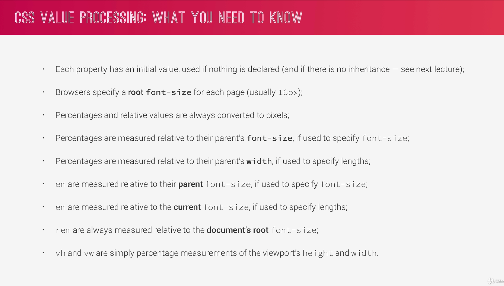
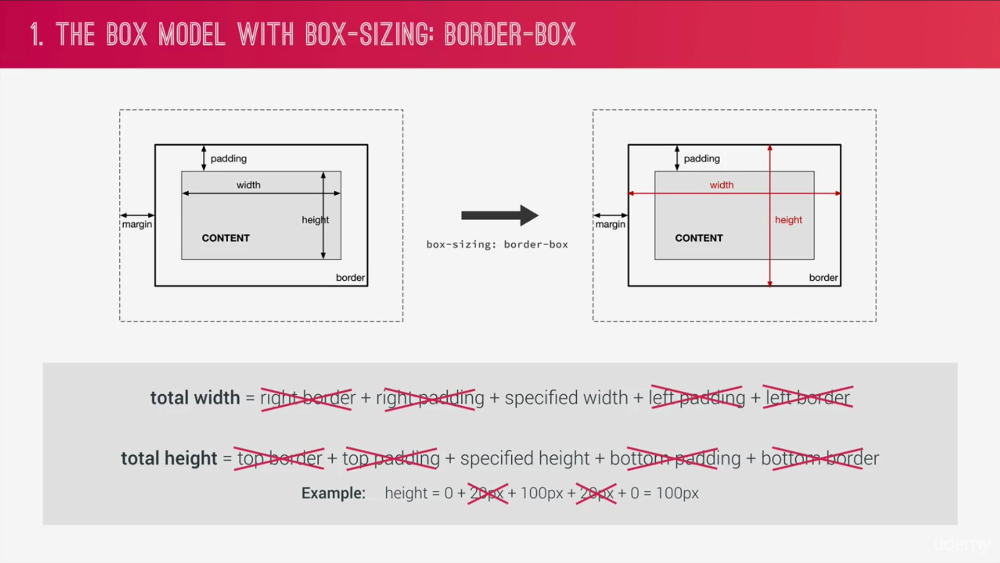
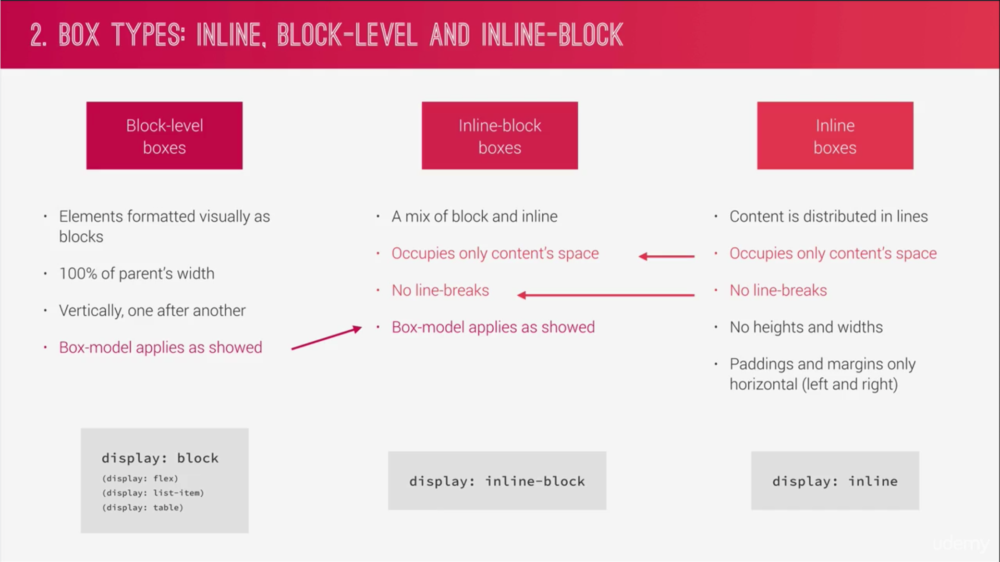
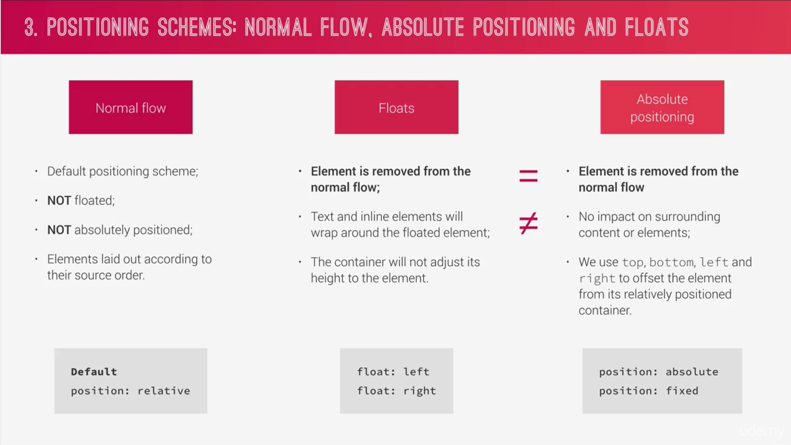

# Advanced CSS and Sass Course on [Udemy](https://www.udemy.com/advanced-css-and-sass/)
I started back over and plan to cruise back through the course.

## Section 2

- `clip-path` 

## NOTES
Resetting or normalizing CSS is less important now with better implementation in browsers. Basic reset should only need...
```css
* {
  margin: 0;
  padding: 0;
  box-sizing: border-box;
}
```  

When working with a background image, don't forget to set the background-position as well.
```css
div {
  background-size: cover;
  background-position: top; / sets the 
}
```  

Clip path works like a clipping mask that is set to coordinates. 
```css
div {
  clip-path: polygon(x y, x y, x y, x y);
}
```

## Section 3

### 3 Pillars of Good HTML and CSS (#13)
1) Responsive Design  
  - fluid layouts
  - media queries
  - responsive images
  - correct units
  - dektop-first vs mobile-first
2) Maintainable and Scalable Code  
  - clan
  - easy-to-understand
  - growth
  - reusable
  - how to organize files
  - how to name classes
  - how to sturcture HTML
3) Web Performance  
  - less HTTP requests
  - less code
  - compress code
  - use a CSS prepocessor
  - less images
  - compress images

### What happens to CSS when we load up a webpage?

Load HTML -->--Parse HTML--> ------------>------------------>----------------- DOM-------->-------+
                  |                                                                               |
                  |                                                                               |
                  |                                                                               |
                  Load CSS --> Parse CSS   --> -------------------------- --> CSS Object Model----|
                                - resolve conflicting CSS declarations                            |
                                - Process final CSS                                               |
                                                                                                  |
                Final rendered website <=----------Website rendering: <-------------------<--Render tree
                                              (the visual formatting model)

### How CSS is parsed (#14) 

A CSS rule has...
- a selector
- a declaration block that has
  - properties
  - declarations

#### Cascade  

Importance > Specificity > Source Order

Importance  
- User `!important` declarations
- Author `!important` declarations
- Author decla rations
- User declarations (browser settings)
- Default browser settings

Specificity
- Inline styles
- IDs
- Classes, pseudo-classes, attribute
- Elements, pseudo-elements

Source Order
- duh, order




-----  
### How CSS Renders a Website

1. The Box Model 
2. Box Types: 
  1. Inline
  2. Block-level
  3. inline-block
3. Positioning Schemes: 
  1. normal flow
  2. absolute positioning
  3. floats


-----
### CSS Architecture, Components, and BEM  

HA! - he directly quotes Atomic Design

THINK => BUILD => ARCHITECT

#### BEM - Block Element Modifier
- **Block:** stand alone component that is meaningful on it's own
- **Element:** part of a block that has no standalone meaning
- **Modifier:** a different version of a block or an element.

#### The 7-1 Pattern
- 7 different folders for parital Sass files, and
- 1 main Sass file to import all the other files into
- a compiled CSS styleshett
Folders
- 1) base/
- 2) components/
- 3) layout/
- 4) pages/
- 5) themes/
- 6) abstracts/
- 7) vendors/


-----
### Implementing BEM (3/21)


-----
## Section 4 - Introduction to Sass and NPM  

-----  
### Introduction (4/22-23)
Sass is a CSS preprocessor that compiles Sass code to regular CSS.  

Main features
- Variables
- Nesting
- Operators
- Partials and imports
- Mixins - reusable pieces of CSS
- Functions - similar to mixins, with the deff that they produce a value that can be used.
- Extends - to make diff selectors inherit declarations that are common to all of them
- Control directives - for writing complex code using conditionals and loops (not covered here)  

-----
### Sass Mixins, Extends, and Functions (4/25)
[Tutorial done in Codepen](https://codepen.io/cfsanderson/pen/bxqbVd)

-----
### NPM Packages - Installing Sass Locally  

- `node -v` to check if installed
- `npm init` opens walkthrough to create a `package.json` file
- `npm install node-sass --save-dev` = installs the node-sass dependencies and `--save-dev` specifies it as a development only dependency.